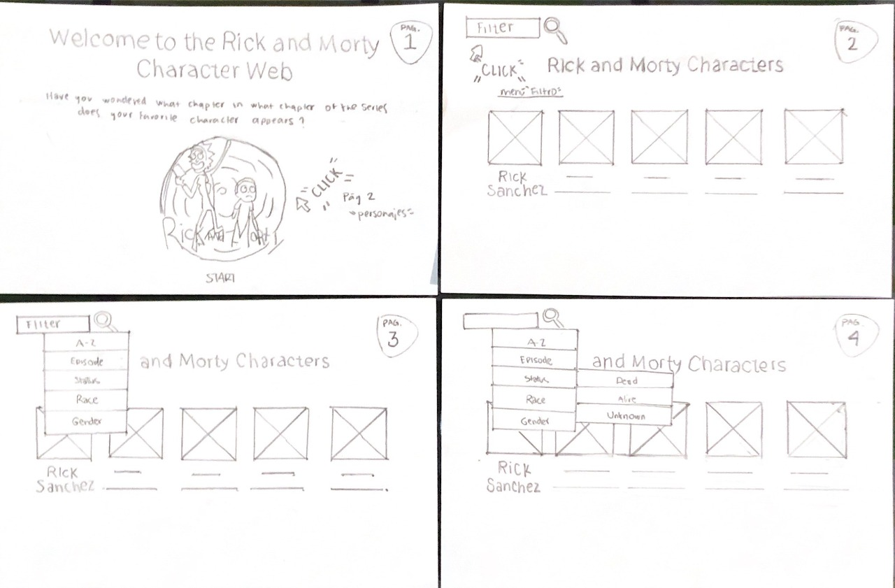
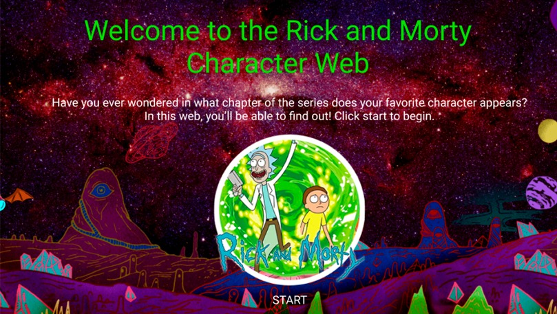
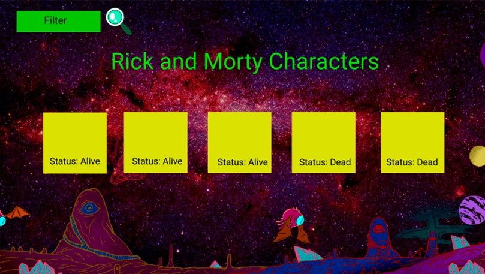
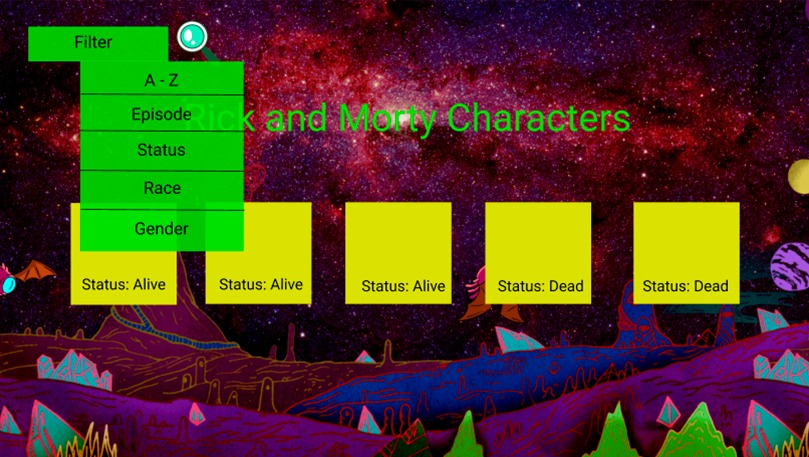
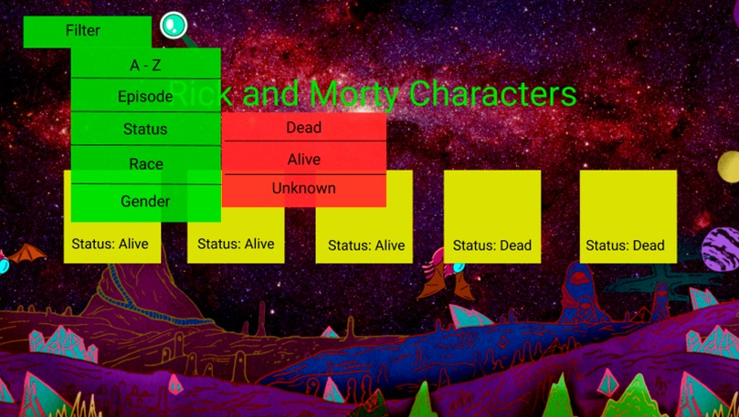

# Data Lovers: 'The Rick and Morty Character Web'

## Índice
* [1. Definición del producto](#1-Definición-del-producto)
* [2. Historias de Usuario](#1-Historias-de-Usuario)
* [3. Prototipo de baja fidelidad](#3-Prototipo-de-baja-fidelidad)
* [4. Prototipo de Alta fidelidad](#4-Prototipo-de-alta-fidelidad)
* [5. Testeos de Usabilidad](#5-Testeos-de-Usabilidad)

***

## 1. Definición del proyecto.

'The Rick and Morty Character Web' fue diseñada para que los fans de Rick and Morty puedan saber en que episodio aparecen sus personajes favoritos, además de obtener más datos sobre ellos como género y especie. 
El usuario principal son jóvenes (+18), fans de Rick and Morty, que quieren saber más sobre su serie favorita y poder ver el episodio donde aparece su personaje favorito.

## 2. Historias de usuario.

### Historia 1
#### Yo como: 
Usuario de la página R&M
#### Quiero:
Saber de que se trata la pagina
#### Para:
Saber si quiero utilizarla
##### Criterios de Aceptación de la HU
- La web de R&M debe contener una página de inicio.
- El usuario debe presionar el botón de iniciar para entrar a la página de los personajes.

### Historia 2
#### Yo como:
Fan de Rick & Morty
#### Quiero:
Conocer el nombre, genero y especie de los personajes
#### Para:
Divertirme y aprender más sobre ellos
##### Criterios de Aceptación de la HU
- La página debe permitir al usuario visualizar los nombres de los personajes.
- La página debe permitir al usuario visualizar los generos de los personajes.
- La página debe permitir al usuario visualizar las especies de los personajes.
- La página debe permitir al usuario filtrar los personajes por genero.
- La página debe permitir al usuario filtrar los personajes por especie.
- La página debe mostrar una imagen del personaje.

### Historia 3
#### Yo como:
Usuario de la página R&M
#### Quiero:
Conocer en que episodio se presenta un personaje "x"
#### Para:
Poder ver el episodio donde sale mi personaje favorito.
##### Criterios de Aceptación de la HU
- La página debe permitir al usuario visualizar en que episodio aparecen los personajes.
- La página debe permitir al usuario filtrar los personajes por episodio.

## 3. Prototipo de baja fidelidad.

## 4. Prototipo de alta fidelidad.

## 5. Testeos de usabilidad.

Se realizaron diferentes testeos de usabilidad, tanto con personas dentro de Laboratoria como por fuera.
El feedback recibido nos ayudó a modificar los siguientes aspectos de nuestro proyecto.

- Interfaz de colores distintos, a pesar de que eran los de la paleta, se veían con un contraste alto, lo cual dificultaba la lectura de los datos.
- Menú "on top" de los personajes, para no generar un desplazamiento innecesario y facilitar el uso del proyecto.
- Centrar el "grid".
- Imagen más grande para cada uno de los personajes.
- Fondo más neutro, que no contenga tantas imagenes para facilitar que el contenido sea más legible.

